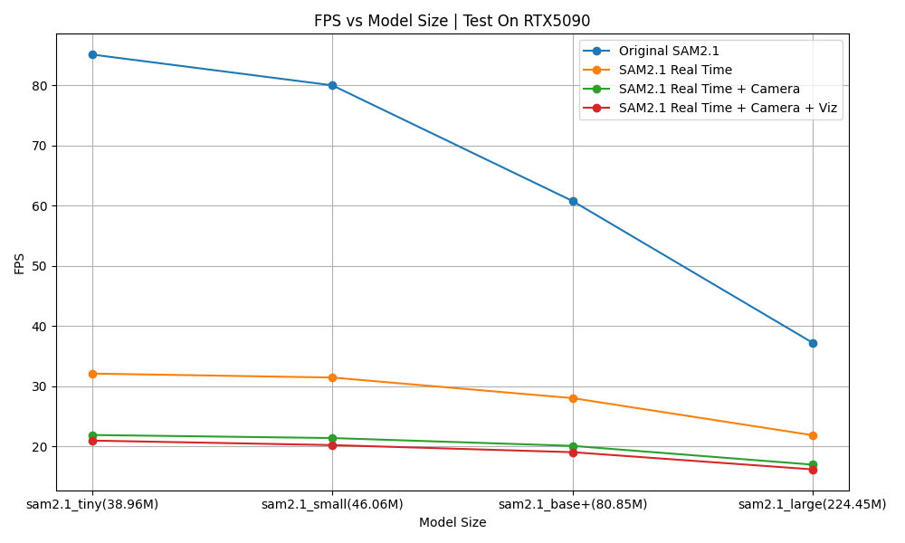

# RSAM2

RSAM2 is a lightweight wrapper for real-time video stream segmentation using the [SAM2 (Segment Anything Model 2)](https://github.com/facebookresearch/sam2) framework. It provides scripts and utilities for running segmentation on video streams and benchmarking inference speed.

The FPS test result is shown below:


## Features

- Real-time video segmentation using SAM2
- Minimal dependencies and easy integration

## Requirements

- Python 3.8+
- PyTorch (with CUDA support recommended)
- [SAM2 framework](https://github.com/facebookresearch/sam2) and its dependencies

## Installation

1. **Install the SAM2 framework**  
   Follow the instructions in the [SAM2 repository](https://github.com/facebookresearch/sam2).

2. **Clone this repository**
    ```bash
    git clone https://github.com/yourusername/RSAM2.git
    cd RSAM2
    ```

3. **Download model checkpoints**  
   Place the required model checkpoints in the `checkpoints/` directory.

## Usage

### Real-time Video Segmentation (RSAM2)

Run real-time segmentation using a camera or video stream:

```bash
python fwd_rsam.py
```

- By default, this will use the camera and segment objects in real time.
- You can adjust the checkpoint and config in the script or via command line arguments.

### Video Segmentation (Original SAM2)

Benchmark segmentation on a directory of video frames:

```bash
python fwd_video.py
```

- This script copies a sample image to simulate a video, runs segmentation, and reports FPS.
- Edit the script to use your own video frames or adjust parameters.

### Image Segmentation (Original SAM2)

Run segmentation on a single image:

```bash
python fwd_image.py
```

- This script demonstrates interactive segmentation on a static image.
- You can modify the prompt points and image path as needed.


## Citation

If you use this codebase, please cite the original SAM2 paper

## License

MIT License